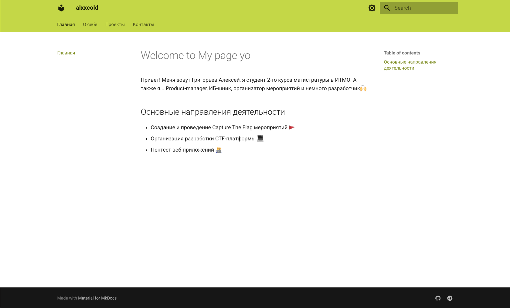
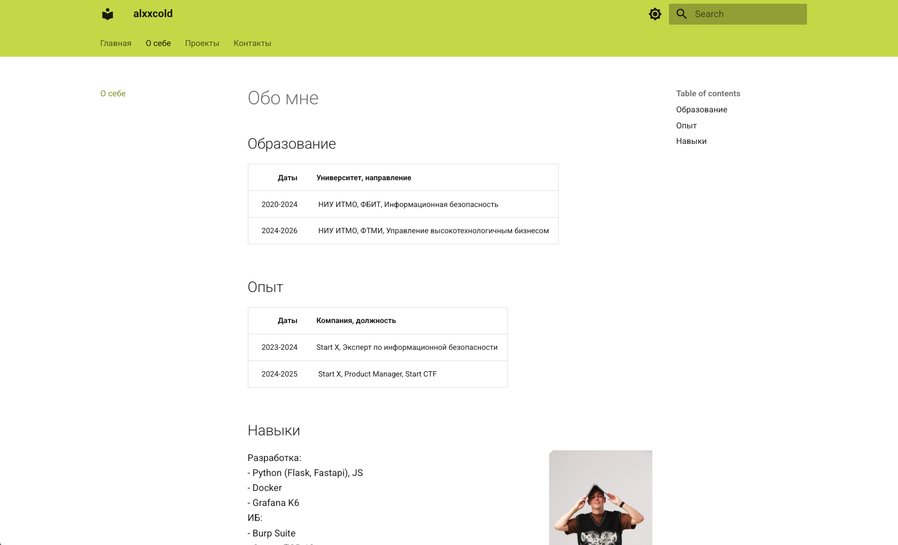
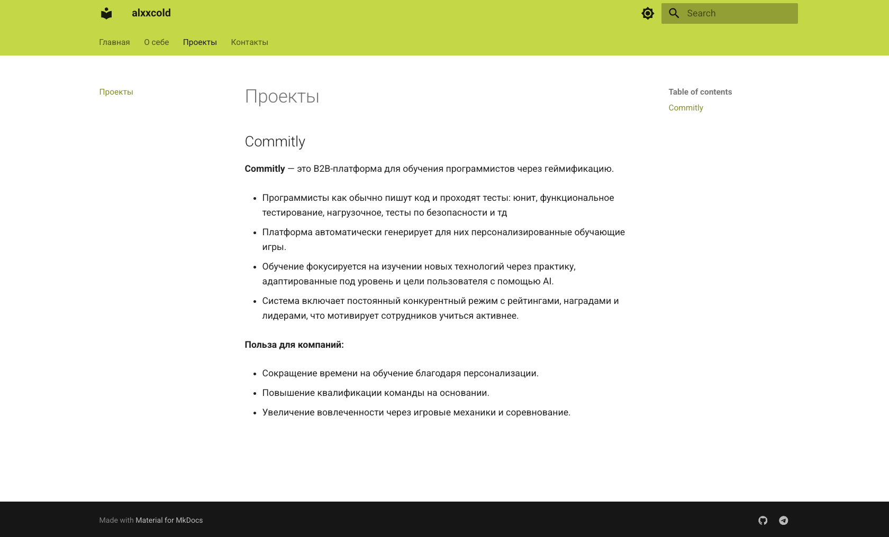
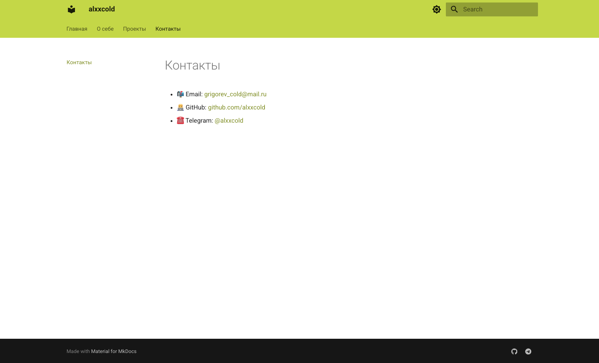

# Курсовая работа
University: [ITMO University](https://itmo.ru/ru/)\
Faculty: [FTMI](https://ftmi.itmo.ru/)\
Course: [Introduction in web tech](https://itmo-ict-faculty.github.io/introduction-in-web-tech/)\
Year: 2025\
Group: U4225\
Author: Grigoryev Alexey Pavlovich\
Name: Coursework\
Date of create: 16.10.2025\
Date of finished: 16.10.2025

## Интро
В данной курсовой работе создаётся персональный сайт с использованием технологии [Mkdocs](https://www.mkdocs.org/).

## Описание проекта

Главная страница — небольшое интро:

Полноценная страница с рассказом о себе:

Страница с описанным студенческим проектом:

Страница с контактами:

## Особенности проекта

1. Использование иконок с ссылками на социальный сети.
2. Навигация на верхней вкладке.
3. Вкладка поиска по странице.
4. Красивый лаймовый цвет + возможность тёмной темы.

## Установка и запуск

1. `gh repo clone alxxcold/devops-lab-grigoryev`
2. `cd coursework`
3. `pip install -r requirements.txt`
4. `mkdocs serve`
5. Перейти по [адресу](http://localhost:8000) на локальной машине.