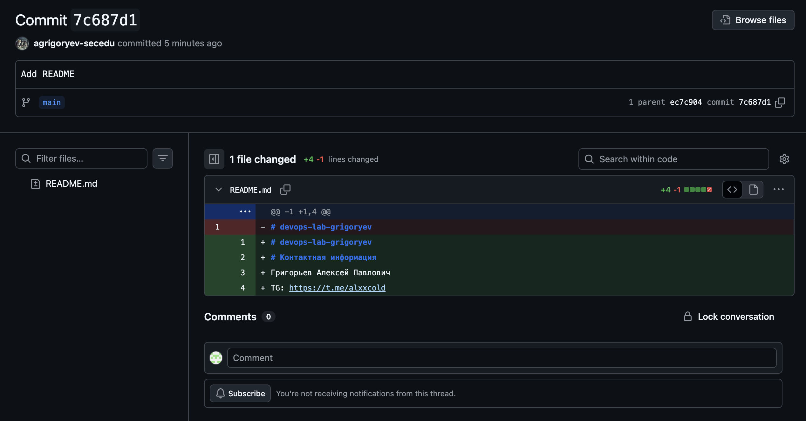
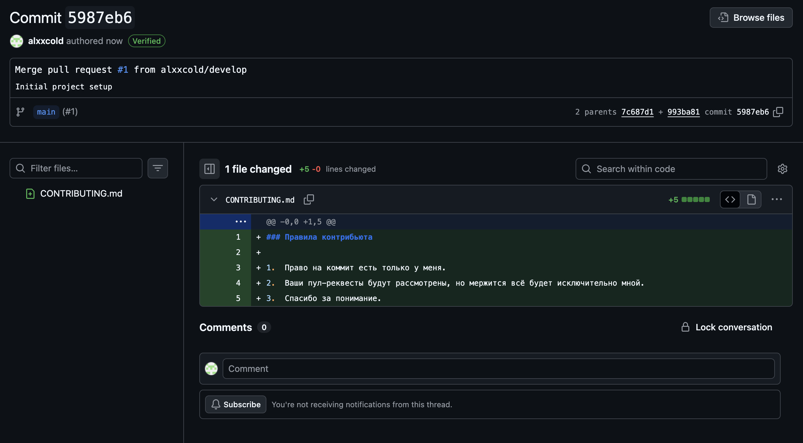

University: [ITMO University](https://itmo.ru/ru/)
Faculty: [FTMI](https://ftmi.itmo.ru/)
Course: [Introduction in web tech](https://itmo-ict-faculty.github.io/introduction-in-web-tech/)
Year: 2025
Group: U4225
Author: Grigoryev Alexey Pavlovich
Lab: Lab0
Date of create: 29.09.2025
Date of finished: 29.09.2025

Hestory of this repo represents completing lab0
1. ADD Readme 

2. Mergre PR from develop 
