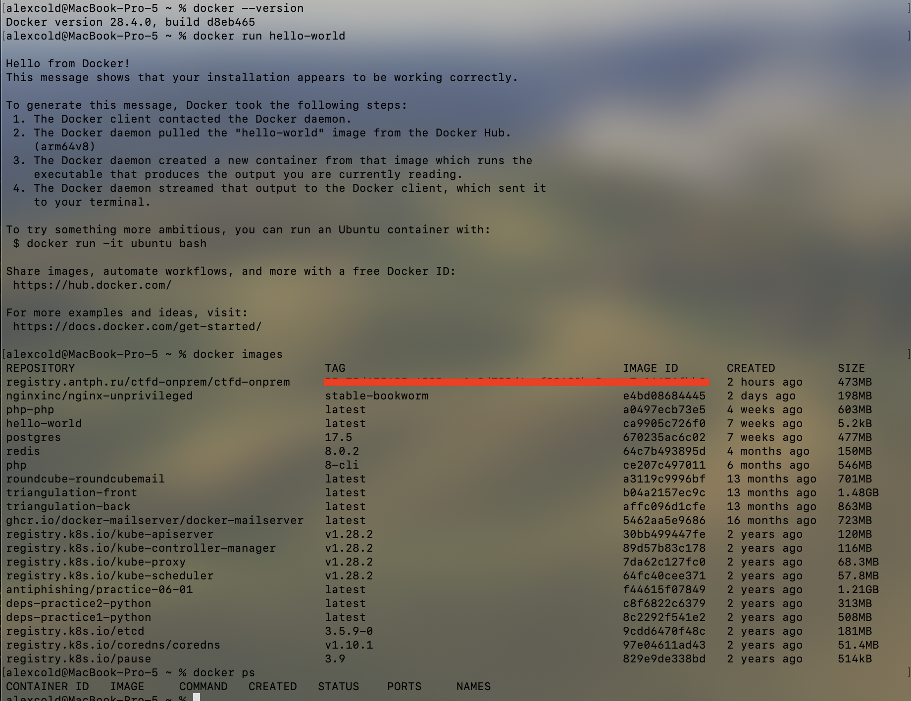
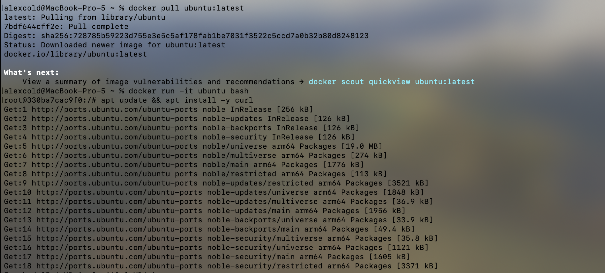
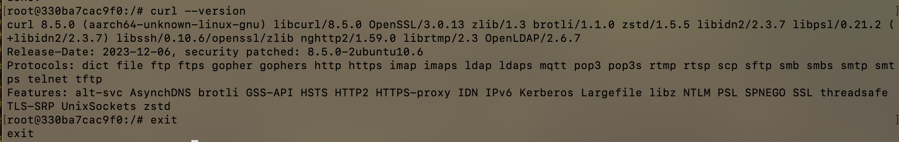
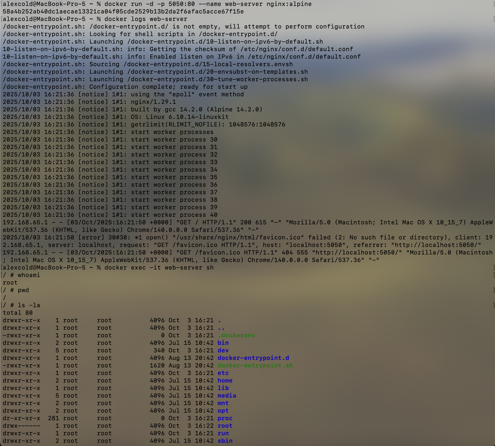
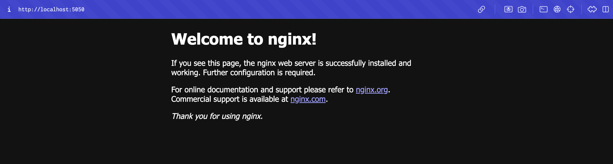
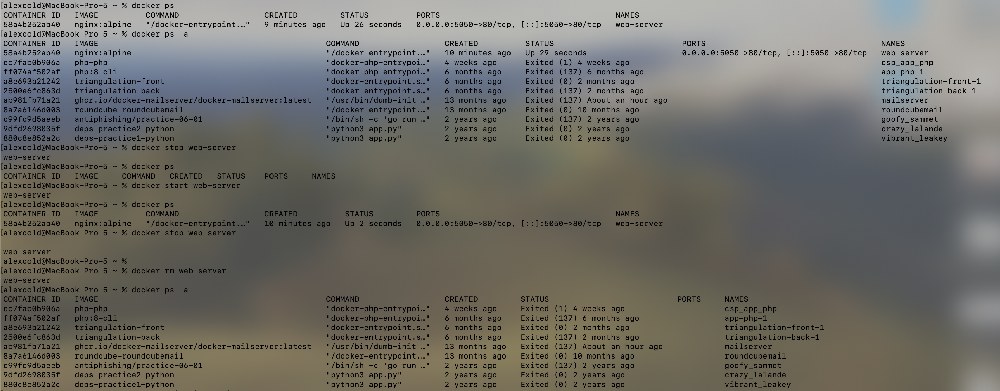
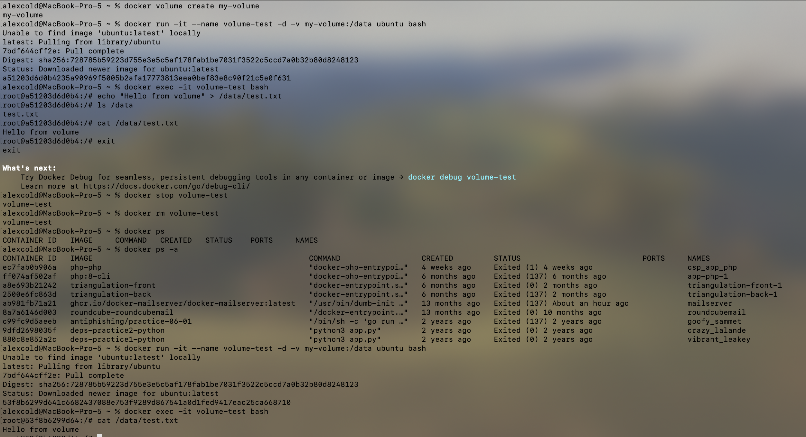
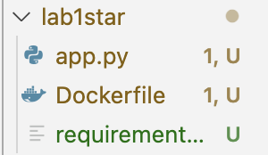
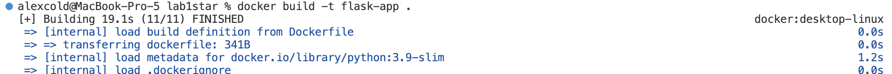
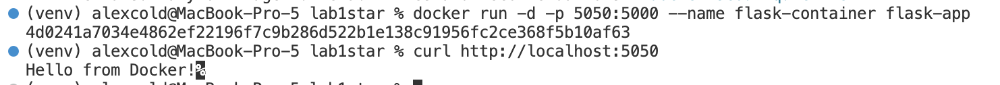

University: [ITMO University](https://itmo.ru/ru/)\
Faculty: [FTMI](https://ftmi.itmo.ru/)\
Course: [Introduction in web tech](https://itmo-ict-faculty.github.io/introduction-in-web-tech/)\
Year: 2025\
Group: U4225\
Author: Grigoryev Alexey Pavlovich\
Lab: Lab1\
Date of create: 03.10.2025\
Date of finished: 03.10.2025

Screenshots to prove lab1 completion:
1. Установка Docker

2. Работа с готовыми образами

3. Запуск веб-сервера

4. Управление контейнерами

5. Работа с томами

Lab1*

1. Создание файлов проекта

2. Создаем Dockerfile по инструкции (Dockerfile находится в папке lab1star)
3. При запуске видим, что выходит ошибка — недостаточно Python пакетов, придётся запускать локально и понять, какие файлы нужны
`python3.9 -m venv venv`
`source venv/bin/activate`
`pip install flask`
`pip freeze > requirements.txt`
Мы локально создали среду для запуска python, скачали нужные зависимости и "заморозили" их, теперь можно запускать.
4. Билдим, запускаем и делаем запрос к контейнеру — все работает

