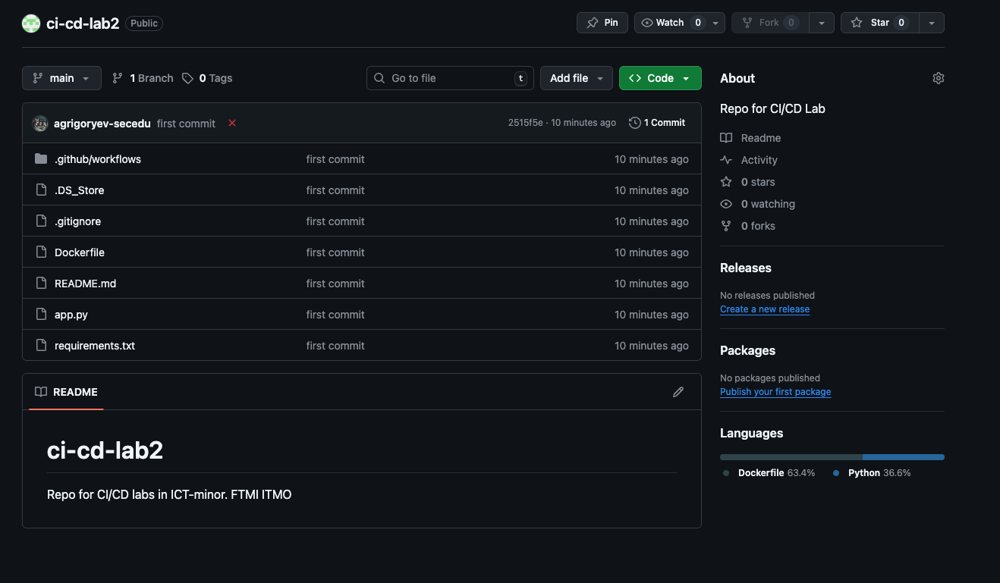
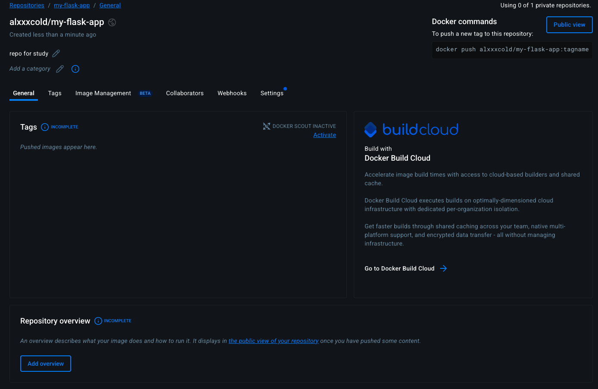
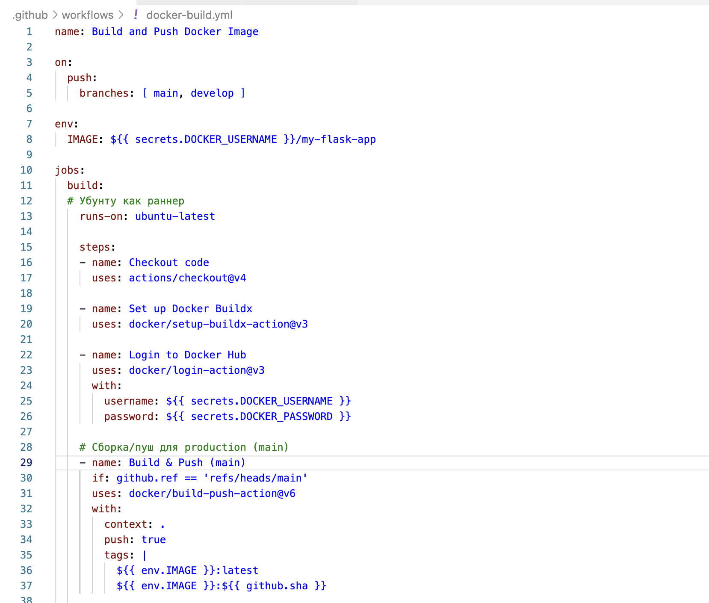
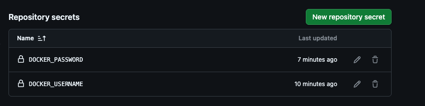
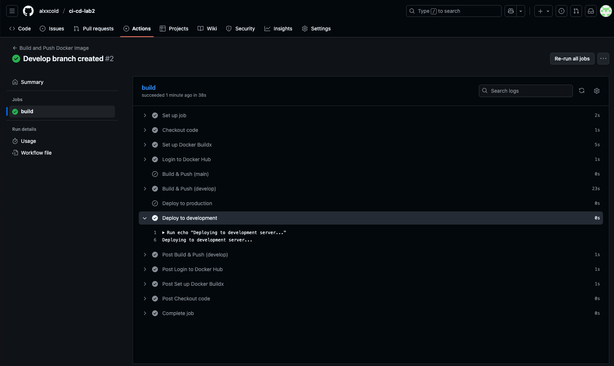
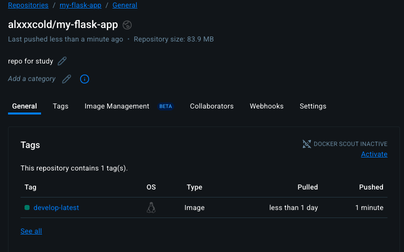
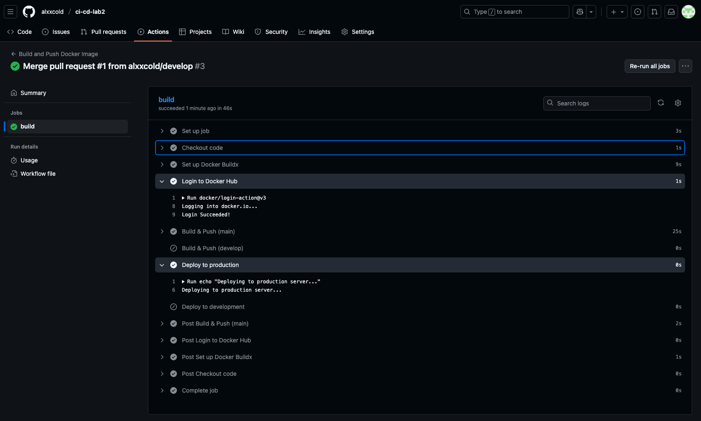
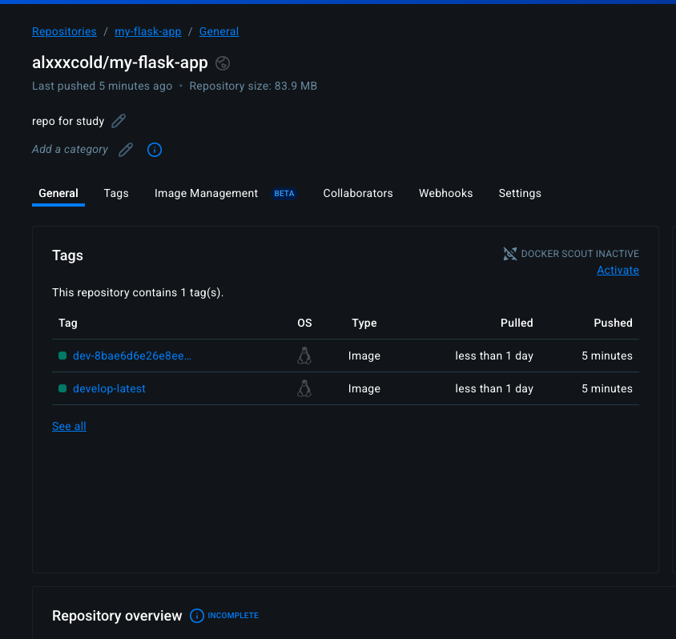

University: [ITMO University](https://itmo.ru/ru/)\
Faculty: [FTMI](https://ftmi.itmo.ru/)\
Course: [Introduction in web tech](https://itmo-ict-faculty.github.io/introduction-in-web-tech/)\
Year: 2025\
Group: U4225\
Author: Grigoryev Alexey Pavlovich\
Lab: Lab2\
Date of create: 13.10.2025\
Date of finished: 13.10.2025

В связи с тем, что лабораторная со звёздочкой включает в себя базовую лабу, скриншоты будут идти сразу для lab2 и lab2star:

1. Подготовка проекта [gh repo](https://github.com/alxxcold/ci-cd-lab2):

2. Настройка GitHub Actions (сразу на 2 ветки):

3. Настройка Secrets:

4. Выполнение Pipeline + логи в ветке Develop:

5. Образ в Docker Hub (тэг develop-latest):

6. Выполнение Pipeline на коммит в main (merge) + логи:

7. Образ из main в Docker Hub:
