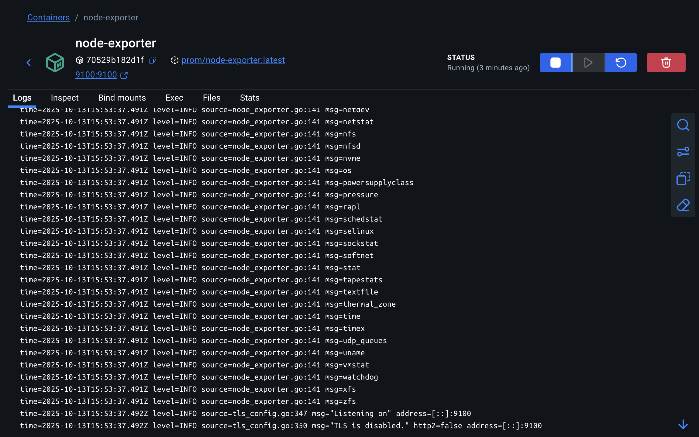
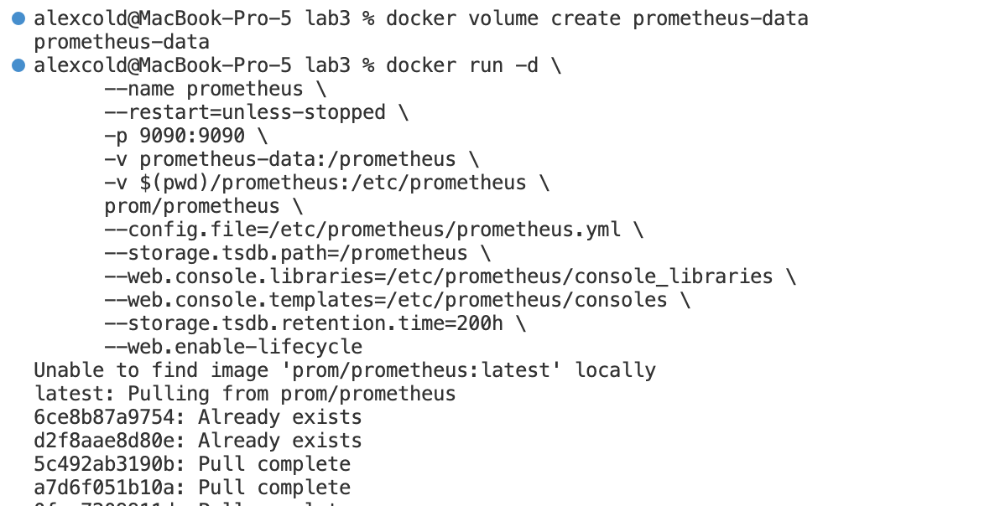
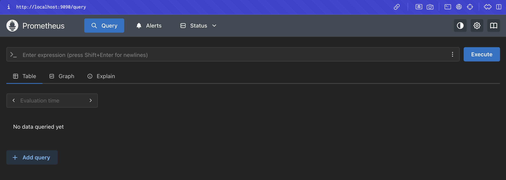
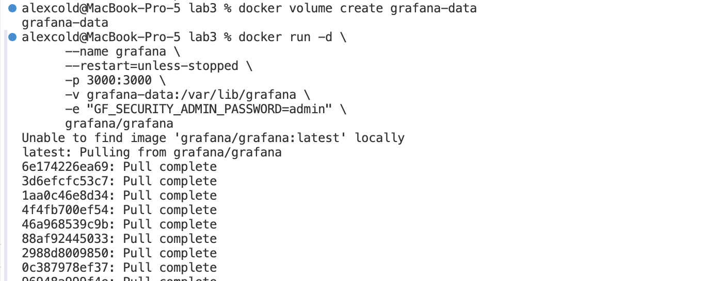
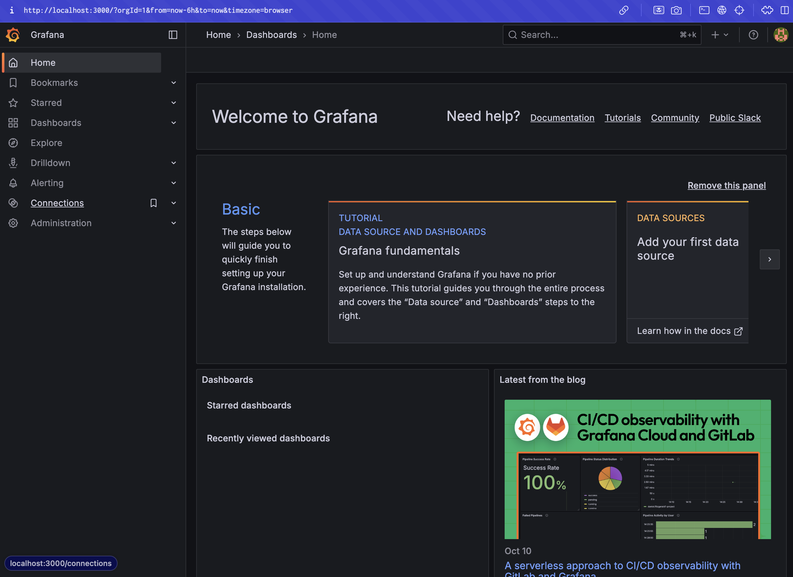
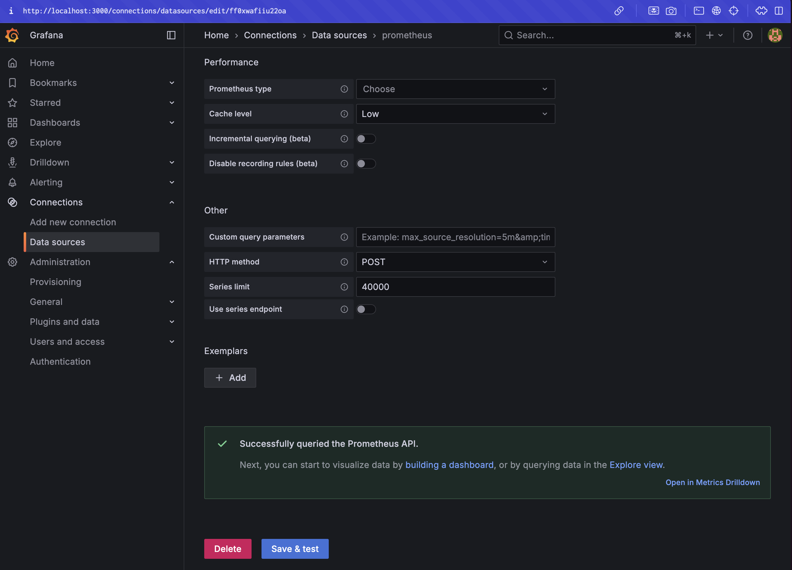
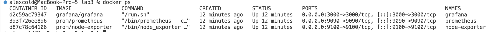
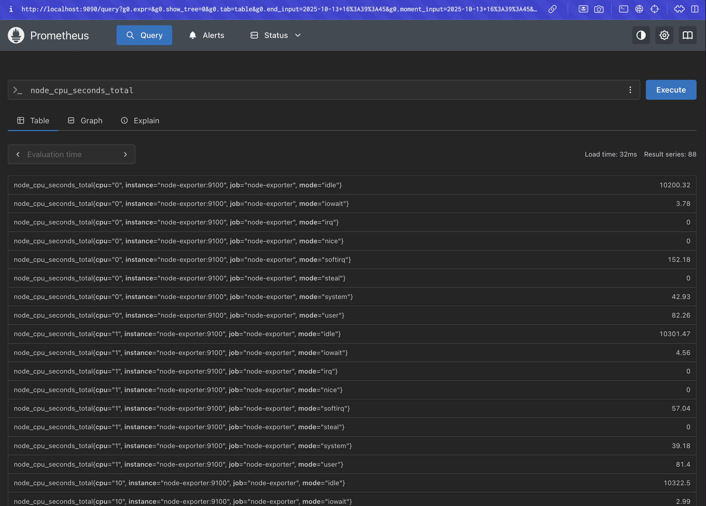
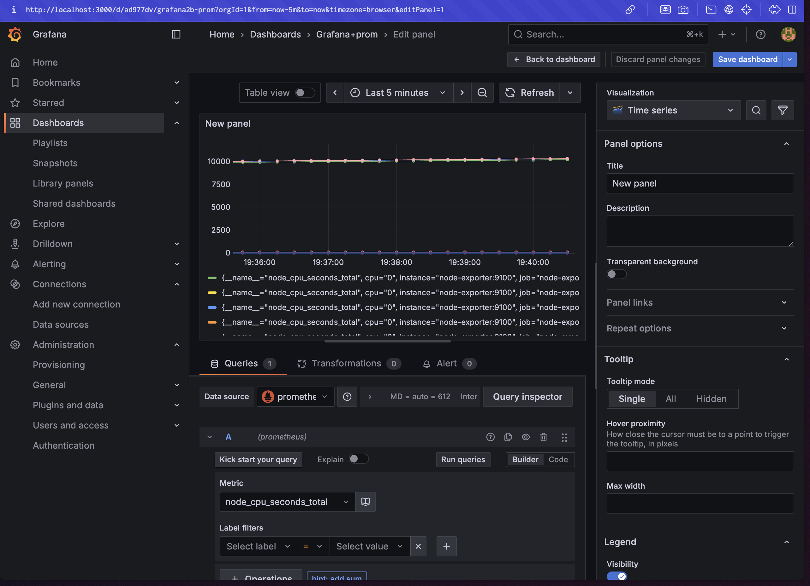
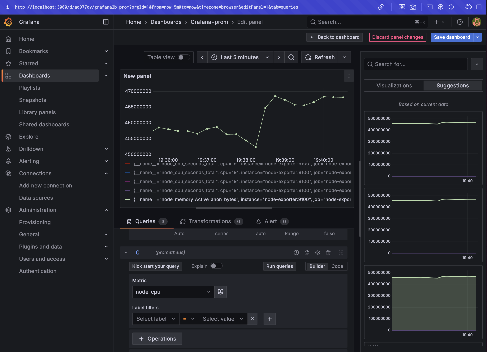

University: [ITMO University](https://itmo.ru/ru/)\
Faculty: [FTMI](https://ftmi.itmo.ru/)\
Course: [Introduction in web tech](https://itmo-ict-faculty.github.io/introduction-in-web-tech/)\
Year: 2025\
Group: U4225\
Author: Grigoryev Alexey Pavlovich\
Lab: Lab3\
Date of create: 13.10.2025\
Date of finished: 13.10.2025

Скриншоты по лабе 3:

1. Создание конфигурации Prometheus (находится в папке Prometheus).
2. Запуск Node Exporter и проверка работы (вывод curl лежит в файле prometheus/node_output.txt):

3. Запуск Prometheus:

4. Запуск Grafana:

5. Для того, чтобы взаимодействовали контейнеры создаем сеть, перезапускаем контейнеры с флагом --network, после этого настраиваем Grafana:

6. Тестирование системы:

Запросы в Prometheus

Графики в Grafana

График памяти
